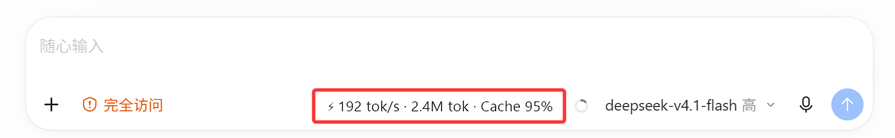

# CodexStatusbar

**简体中文** · [English](README.md)



<https://github.com/dongyue-19/codex-statusbar> · MIT 许可 · **v1.0.0-rc3**（release candidate，功能已冻结）

**获取可执行文件：** 从 [最新 release](https://github.com/dongyue-19/codex-statusbar/releases) 下载
`CodexStatusbar.exe` —— 自包含的 61 MB 单文件，不需要安装 .NET 运行时 —— 把它放到
`start-monitor.bat` 旁边然后运行该脚本。exe 是 release 附件而不是提交进仓库的文件，因此仓库体积
保持在源码量级。`release\` 里保留启动脚本、发布说明与所发布二进制的 SHA-256。

**自行构建：** `pwsh -File build.ps1`（需要 .NET 10 SDK）—— 见 §3。

一个轻量、始终可见的状态条，面向 **Windows 上的官方 OpenAI Codex Desktop 客户端**。它不做任何
点击、直接显示三个数字：

```
⚡ 243 tok/s   ·   5.7M tok   ·   Cache 98%
```

默认情况下它停靠**在 Codex 自己的输入框底栏内部** —— 紧贴 Context 用量指示器的左侧，与模型
选择器、麦克风和发送按钮在同一行。它只在完全透明的背景上绘制文字，因此读起来像是 Codex 界面的
一部分，而不是一个 HUD（平视显示）；当底栏变窄时，它会退化为更短的形式，而不是压住它左侧的
控件。带 DPI（每英寸点数）感知偏移的手动九锚点模式仍然作为回退方式保留（§4）。

它是一个**独立的伴随进程**。它不修改、不替换、不注入、也不挂钩（hook）Codex 二进制。它读取
Codex 自己已经写下的数据，并用公开的 Win32 API 把一个很小的覆盖窗口（overlay window）附着在
Codex 窗口旁。

---

## 1. 三个核心指标 —— 严格定义

### A. TPS（每秒输出 token 数） —— 模型输出速度

```
turn_tps = 1000 × Σ(official output_tokens of the turn's model responses)
                ÷ |union of the turn's Reasoning and AgentMessage item windows|
```

用文字表述：**官方 output token 数 ÷ 模型真正用于产出输出的时间。** 只有 `Reasoning` 与
`AgentMessage` 两种条目的时间窗参与计算。`CommandExecution`、`FileChange`、`McpToolCall`、
`WebSearch`、`UserMessage`、`ImageView` 的时长**在构造上就被排除** —— 任何工具执行、用户思考
时间、排队时间、整轮墙钟时间都永远不会进入分母。

**分母是区间并集（interval union），不是求和。** `Reasoning` 与 `AgentMessage` 的时间窗可能
重叠或相接，参与计算的是合并后的长度：覆盖 `[0 s,5 s]` 与 `[4 s,10 s]` 的两个时间窗是 **10 s**
的模型活动，而不是 `5 + 6 = 11 s`。工具时间窗永不参与合并，因此夹在两个模型时间窗*之间*的工具
调用不会把两者桥接起来。

这**不是**估算，也**不是**按字符数换算的替代品 —— 分子永远是官方 token 计数，分母永远是实测的
模型活动时间。它也不等同于你从原始 SSE 流上量到的速度，因此这里把它描述为*由官方 token 用量
推导出的模型吞吐*，而不是声称它在数学上精确。

**实测精度。** `tools/groundtruth_tps.mjs` 会以 `experimentalRawEvents` 启动它自己的
app-server，运行各种形态的轮次，并为每一轮同时记录两个速度：直接从流式增量测得的，以及由上面
这个公式推导出的 —— 两者分子相同，所以唯一的差异在于耗时是怎么来的。14 轮（短/长散文、
偏重推理、偏重代码、中日韩文字、混合语言、markdown 表格、两档 effort）：

| 统计量 | 数值 |
|---|---|
| 实测轮数 | 13（有一条 2 token 的回复没有可用的时间窗） |
| **相对误差中位数** | **0.04 %** |
| **相对误差 P95** | **16.7 %** |
| **相对误差最大值** | **16.7 %** |
| 误差在 0.2 % 以内的轮数 | 13 轮中 11 轮 |

每一轮正常长度的回答都在 0.0–0.2 % 之内一致。唯一的离群值是一条 57 token 的回答，它整个模型
时间窗只有 **18 ms** —— 在那里成为瓶颈的是计时信号的分辨率，而不是公式。实际结论：任何模型
时间窗短于约 0.5 s 的读数都应视为噪声；展开面板与调试日志都会打印时间窗长度，便于你自己判断。

**token 语义，已验证。** `output_tokens` 是模型产出的全部内容，而 `reasoning_output_tokens` 是
它**子集**，因此 `visible = output − reasoning`。所以分子包含隐藏的推理 token，分母包含
`Reasoning` 时间窗，两边覆盖的是同一段区间。在每一个实测轮次上都检查过
（14 轮中 `reasoning_output_tokens <= output_tokens` 全部成立）。

* 分子**永远是官方 token 计数**。token 从不按字符数估算，本项目任何地方都没有使用分词器
  （tokenizer）。
* `live_tps`（`Current realtime TPS`）是同一个比值在**进行中的轮次到目前为止**的重新计算；
  每当一个模型响应完成它就推进一次。
* `last_turn_tps`（`Last completed TPS`）是刚刚结束那一轮的最终值。它在**生成停止后仍然保留** ——
  状态条不会重置回 `--`。
* 相邻采样点用 EMA（指数移动平均）平滑（`alpha = 0.35`，滞后不到约 3 个采样点），这样数字不会
  在响应边界上抖动。
* 前置的 `~`（`⚡ ~192 tok/s`）标记一个被*保持*的值：自该值被测得以来，生成已经向前推进了
  （有工具调用完成，或累积了更多模型时间）。
* 如果算不出来就显示 `--`。非有限、零或负的值都显示 `--`，而高于 100 000 tok/s 的比值会直接
  拒绝显示，而不是画出来。**任何东西都不会被编造出来。**

**为什么没有原始流式增量。** Codex Desktop 不持久化任何流式增量：rollout（Codex 的会话记录
文件）的 JSONL 里只有 `item_completed` 记录（`item_updated` / `agent_message_delta` 并不作为
持久化记录存在），而桌面端自己的 `codex app-server` 通过 stdio 绑定在 Electron 主进程上，外部
进程无法接入它的事件流。`item_completed` 确实带有 `started_at_ms` / `completed_at_ms`，上面用的
就是这个官方的逐条目模型输出时间窗。

**TPS 状态机。** `idle` → `waiting` → `generating` → `completed`，在调试日志中原样报告：

| 状态 | 状态条显示什么 |
|---|---|
| `idle` —— 还没看到任何轮次 | `-- tok/s` |
| `waiting` —— 新一轮开始，尚无模型输出 | `-- tok/s`（绝不显示上一轮的值） |
| `generating` —— 已测到模型输出，轮次进行中 | 实时值，每个响应更新一次 |
| `generating`，工具正在运行 | **保留**上一次的模型值，绝不显示 `0 tok/s` |
| `completed` —— 轮次结束 | 该轮的最终值，予以保留 |

### B. Total tokens —— 当前对话的累计值

```
conversation_total_tokens = Σ input_tokens + Σ output_tokens
```

这**不是**上下文窗口用量，也**不是**当前提示词长度。它是这个对话自创建以来模型处理过的全部
内容。

`cached_input_tokens` 是 `input_tokens` 的**子集**。因此：

```
total = input + output          ✔  correct
total = input + cached + output ✘  double-counts the cache, must never be used
```

本机一个真实会话的算例：

```
input          2,126,561
cached input   2,045,696   (already inside input — do not add)
output            23,166
-------------------------------------
total          2,149,727   = input + output   (equals official total_tokens)
wrong formula  4,195,423   = input + cached + output
```

显示格式（保留一位小数）：

| 区间 | 显示为 |
|---|---|
| `< 1K` | `843 tok` |
| `1K … 999,999` | `12.4K tok` |
| `≥ 1M` | `5.7M tok` |

完整整数在内部始终保留，并在展开面板 / 调试日志中显示。

它绑定的是 **Codex Desktop 里当前打开的那个对话**，而不是整个 `~/.codex`。在 Codex 侧栏里切换
对话会切换状态条（见 §4）。

### C. Cache hit rate —— 当前对话的累计命中率

```
cache_hit_rate = Σ cached_input_tokens / Σ input_tokens × 100%
```

在**整个对话**上取平均，而不只是最后一轮。显示时不带小数（`Cache 98%`；展开面板中是
`97.88%`）。当 `input_tokens == 0` 时它显示 `Cache --` —— 绝不是 `NaN`，绝不是 `0%`。

---

## 2. 这些数字从哪里来

| 指标 | 主要来源 | 恢复 / 回退来源 |
|---|---|---|
| TPS | rollout 的 `event_msg/item_completed`（`started_at_ms`、`completed_at_ms`）+ 每个响应的官方 `output_tokens` | 无 —— 取不到就显示 `--` |
| Total | rollout 中的累计用量（`input + output`） | `state_5.sqlite` → `threads.tokens_used` |
| Cache | rollout 中的累计用量（`cached_input_tokens`、`input_tokens`） | 无 |
| **当前活跃的是哪个对话** | **`\\.\pipe\codex-ipc` 广播 `thread-stream-following-changed` → `conversationId`** | `state_5.sqlite` → 按 `recency_at_ms` 排序的 `threads` |
| TTFT / 轮次时长 | rollout 的 `event_msg/task_complete`（`time_to_first_token_ms`、`duration_ms`） | 无 |

所有来源都以**只读**方式打开。会话文件永不被修改。没有网络访问、没有遥测、没有代理转发、没有
中间人（MITM）、没有 DLL 注入、不碰 Electron 内部。

### 用量载体（carrier）与去重

有两种官方载体承载同一套累计计数器，而存在哪一种取决于 Codex 版本。两种都支持：

| 载体 | 位置 | 出现于 |
|---|---|---|
| `token_usage_record` | `payload.thread_token_usage` | Codex 0.159+ |
| `event_msg` / `token_count` | `payload.info.total_token_usage` | **所有**版本；在 0.151 及更早版本上是**唯一**的载体 |

在本机语料库上验证：501 个会话文件中有 423 个**完全不含 `token_usage_record`**，因此只读这一种
载体的监控器对大多数对话都会报 `0 tok`。

**两种载体都是累计值，所以最新的读数会替换上一个 —— 任何东西都不做加法。** 这让重复读数在构造
上就无害；同时它也会被计数并报告（调试日志里的 `Dedup:`），这样将来某个开始发*增量*的 Codex 会
在诊断里暴露出来，而不是悄悄污染合计。

两个实测出来的陷阱，都已修复并被自检（self-test）钉住：

1. **逐响应重复计数。** 在 0.159 上每个响应都会被报告两次，两次的用量逐字节相同：一次作为
   `token_usage_record.usage`，一次作为 `token_count.info.last_token_usage`。因此按*载体*构造的
   去重键会把每个响应都数两遍 —— 实测正好是 `2x`，这让 TPS 翻倍。现在的键由**数值**派生
   （`input:cached:output:total`），同一个响应的这些值相同，于是先到的载体胜出、后到的被忽略。
2. **在这个版本上 `turn_token_usage` 不是单轮合计。** 在 Codex 26.928.3736.0（core 0.159.2）上，
   每一条记录里的 `turn_token_usage` 都是 `thread_token_usage` 的逐字节副本 —— 也就是整个对话的
   计数器。把它当作单轮分子，会把整个对话的输出算进一轮里。现在只有当它与
   `thread_token_usage` 确实不同时才会使用它。

### 读取策略（性能）

* 会话文件可达 70–270 MB。文件**从不被整篇解析**：先读取有界的 **4 MB 尾部**以恢复累计用量与
  轮次状态，然后只从该偏移开始解析**新增的字节**。
* 如果这个 4 MB 尾部没有给出累计用量，则把窗口**向后加宽（每次翻倍）直到找到用量或到达文件
  开头**，每个窗口都从头重新解析，以便状态始终反映整个窗口。快路径仍是 O(4 MB)；扩展只是安全
  网，调试日志会给它打标记（`tail-window-extended:<n>MB`）。在一个 501 个文件、1 GB 的语料库上
  它一次都没有发生过。
* 面对新对话，尾部读取会立即恢复合计，因此重启恢复是瞬时的，且与历史长度无关。
* 启动时的基线来自 IPC 广播（Codex 在连接后立即发送它），因此监控器重启后会落在正确的对话上。
* 不热循环扫描 `~/.codex`。变更通知是事件驱动的（`FileSystemWatcher`），配合基于偏移的增量
  解析，所以每次更新的代价是 O(新增字节)。
* 每个对话的状态以
  `thread_id → { input, cached, output, current_turn, tps_state }` 缓存。

### 失败时的行为

| 情况 | 行为 |
|---|---|
| Codex 未启动 / `codex-ipc` 不存在 | 以指数退避（350 ms → 5 s）重连，不做忙等轮询；回退到 `state_5.sqlite` 并报告 `active-thread-source = sqlite-fallback` |
| Codex 重启 / Electron 重新加载 | 管道消失后又被重新创建；监控器自行重连并切回 `active-thread-source = ipc` |
| `initialize` 失败或某个帧畸形 | 跳过该帧，监听器重连；一条坏消息永远不会干掉监听器 |
| app-server / 文件不可用 | Total 与 Cache 仍能从会话文件工作；TPS 显示 `--` |
| rollout 格式变了 | 未知记录被忽略、被计数，并列入调试日志的 `Warnings:`；进程永不崩溃 |
| 全新的空对话 | `⚡ -- tok/s · -- tok · Cache --`，文件一出现就会被接上 |
| 不存在 cached 字段 | `Cache --` |

---

## 3. 安装与运行

### 正常使用 —— 什么都不用做

安装完成之后（见下文），**永远不需要任何手动步骤**。Windows 登录会启动
`CodexStatusbar.exe --background`，它带着托盘图标、没有窗口，安静地等待；Codex Desktop 一出现，
它就自行附着；Codex 关闭时状态条随之消失，而监视器继续等待下一次启动。不需要
`start-monitor.bat`，不需要 PowerShell，不需要"先启动监控"，重启电脑之后也不用重做任何事。
§10 完整说明了它是如何工作的、往注册表写了什么、以及怎么关掉。

`start-monitor.bat` 仍然保留，但只用于确实需要它的场合：调试、排障和一次性手动启动。

### 从 release 安装

从 <https://github.com/dongyue-19/codex-statusbar/releases> 下载 `CodexStatusbar.exe`，把它放在
`start-monitor.bat` 旁边，然后：

```
start-monitor.bat
```

发布的构建是自包含的，因此不需要安装 .NET 运行时。先对照 `release\SHA256.txt` 校验下载：

```powershell
Get-FileHash .\CodexStatusbar.exe -Algorithm SHA256
```

### 从源码构建

需要 **.NET 10 SDK**（`net10.0-windows`，Windows x64）：

```powershell
pwsh -File build.ps1              # build + self-test + position probe + publish
pwsh -File build.ps1 -SkipTest    # build + publish only
```

`build.ps1` 会写出 `dist\CodexStatusbar.exe`，而 `start-monitor.bat` 优先使用它；如果 `dist\` 为空，
启动脚本会退回到 `src\CodexStatusbar\bin\Release\net10.0-windows\`。构建不会修改仓库之外的任何
东西，覆盖窗口也从不写入 `%LOCALAPPDATA%\CodexStatusbar\` 之外的位置。

运行要求：Windows 10/11 x64，且 Codex Desktop 在同一用户下运行。请在 Codex Desktop 之后启动
状态条；一旦有 Codex 窗口位于前台，它就会附着上去。

### 命令行

| 参数 | 作用 |
|---|---|
| *（无）* | 覆盖窗口 + 托盘图标 |
| `--debug` | 额外把诊断信息块（§5）写入 `%LOCALAPPDATA%\CodexStatusbar\debug.log` |
| `--background`、`--watch-codex` | 登录模式：只有托盘、没有窗口，Codex 出现时自行附着 —— Run 值启动的就是它 |
| `--no-overlay` | 无界面运行；用于自动化测试，只产出调试日志 |
| `--thread <id>` | 把监控器钉在一个对话 id 上 |
| `--sessions <path>` | 覆盖会话根目录（默认 `$CODEX_HOME\sessions` 或 `~\.codex\sessions`） |
| `--install-startup` | 在 HKCU 中登记"开机自动启动"，并记住该选择 |
| `--uninstall-startup` | 移除该登记，并记住该选择 |
| `--startup-status` | 打印注册表键、解析出的命令，以及它是否仍指向当前这个 exe |
| `--restart-wait` | 内部使用：让一个正在重启的实例等待即将退出的实例释放单实例互斥体 |

### 开机自动启动

**默认开启。** 带此功能的构建在第一次启动时会登记
`HKCU\Software\Microsoft\Windows\CurrentVersion\Run` → `CodexStatusbar` =
`"<full path>\CodexStatusbar.exe" --background`。整个过程都不涉及管理员权限。托盘的
**开机自动启动** 项之后可以切换它，而且关掉就是永久的：没有升级会在你背后重新打开它。细节见 §10。

---

## 4. 覆盖窗口的行为

### 外观 —— 只有文字，没有胶囊底

状态条只绘制**字形（glyph）**。没有胶囊底（capsule）填充、没有边框，因此 Codex 自身的界面会
从数字背后透出：

```
⚡ 243 tok/s · 5.7M tok · Cache 95%
```

它停靠在 Codex 输入框（composer）的底栏内，紧贴官方 **Context 用量**指示器的左侧，与模型选择器、
麦克风和发送按钮在同一行：

```
[ + ] [⚠ 完全访问]          ⚡ 192 tok/s · 2.4M tok · Cache 95%   ◔   deepseek-v4.1-flash 高 ⌄   🎙   ↑
```

而且它的设计目标是看起来像那条工具栏的一部分，而不是像一个 HUD：

| | 状态条 | 依据 |
|---|---|---|
| 字体 | **Segoe UI Regular, 13 DIP**（设备无关像素） | Codex 的 `--font-sans-default` 在 Windows 上解析为 Segoe UI，而 `[data-codex-window-type=electron]` 把 `--text-sm` 覆盖为 `13px`。并对照屏幕上的墨迹交叉验证：`完全访问` 是四个全角表意字符，占一个 78 px 的盒子，即在 150 % 下是 13 DIP 的 em。 |
| 颜色（浅色主题） | `#1a1c1f` | Codex 的 `--app-color-text-foreground` —— 而在 Codex 自身正文中测得的最深像素是 rgb(26,28,31) |
| 颜色（深色主题） | `#dfdfdf` | Codex 深色下的 `--color-text` |
| 行高 | 18 DIP | `leading-[18px]`，由权限标签 27 px 的 UIA 文本框印证 |
| 阴影 | **关闭** | 停靠在 Codex 自身背景上时，靠主题匹配来保证可读性 |
| 水平内边距 | 每侧 6 DIP | 窗口按实测文本定尺寸，所以不存在要留白余量的固定宽度 |

结果，与它所依附的控件取自同一张截图来测量：状态条的基线距模型选择器的基线 **1 px**，两者达到的
最深墨色都是 `rgb(26, 28, 31)`。

这是真正的逐像素透明（per-pixel transparency），不是设置某个键控颜色：窗口是一个分层窗口
（layered window）（`WS_EX_LAYERED` + `UpdateLayeredWindow`），由一个 32 位预乘（premultiplied）
ARGB 表面绘制，因此"背景"像素的 alpha 确实是 0。状态条矩形约 88 % 完全透明，只有字形会改变其下方
的像素（实测 —— 见 [`docs/evidence/round2-ui`](docs/evidence/round2-ui/README.md)）。

**为什么不用 `TransparencyKey`。** 那种做法把字形画在一个魔术色上再把它挖掉，于是每条抗锯齿
（anti-aliasing）边缘都会留下那个颜色的色调 —— 也就是经典的光晕（halo）。它是可测量的：用那种
方式画出的同一行文字留下 **1746 个彩色像素、通道差 171**，而分层表面保持在 **10**（中性字形是 5，
那属于颜色自身的差异加上反预乘的舍入）。

因此文字用 GDI+ 和**灰度**抗锯齿渲染。ClearType 的亚像素滤波假设背景不透明；在透明表面上，正是
它的逐通道混合产生了彩色描边。

**可读性。** 停靠在输入框里时，主题匹配已经做了该做的事，不绘制阴影。如果状态条被移到了与背景
不一致的地方，**托盘 → `文字阴影`**（或 `"textShadow": true`）会加上 1 DIP 的反极性阴影，再加一
道更淡的第二遍。

### 主题

`theme = "Auto"`（默认）跟随 **Codex 自己的**外观设置，只读地取自
`%USERPROFILE%\.codex\config.toml` 中 `[desktop]` 下的 `appearanceTheme`；只有当 Codex 没有记录过
该设置时才回退到 Windows 应用主题。这一点很重要：Codex 的设置经常与系统设置相反，而只跟随
Windows 的 `auto` 会把白色字形画到 Codex 的浅色界面上。可以用托盘**主题**菜单强制指定，或在设置
文件里写 `theme = "Dark"` / `"Light"`；菜单里会显示 `Auto` 最终解析成了什么。

### 定位 —— 停靠到 Context 控件，从不使用百分比

默认 `positionMode` 是 **`ComposerContextLeft`**：状态条停靠在输入框底栏内，右边缘位于官方 Context
用量指示器左侧固定若干 DIP 处，垂直中心落在工具行上。

```
strip.right   = ContextControl.left − contextGapDip        (default 10 DIP, target band 8–12)
strip.centreY = toolbar row centre                          (the model selector's own box centre)
```

这两个项都是实时读取的 UI Automation（UIA）矩形。**不存储任何绝对坐标** —— 因此改变窗口大小、
移动 Codex、最大化它、移到另一台显示器或改变 DPI，都会让状态条与 Context 控件保持 10 DIP 的距离，
而不需要从任何一次观测里重新推算。

参照物是按一条梯子（ladder）寻找的，调试日志总会说明用了哪一级：

| 级别 | 来源 | 如何找到 |
|---|---|---|
| 1 | `uia-context` | 输入框卡片（composer card）的 `Image` 子节点，其名称以 `上下文用量` / `Context usage` 开头，或其 class 含 `codex-description`，或它就是输入框唯一的 `Image` 子节点。**实际运行中用的就是这一级。** |
| 2 | `uia-model` | 一个暴露 **ExpandCollapse** 模式的 `Button`，位于 Context 指示器右侧；用它的左边缘代表 Context 控件的左边缘，再减去实测的、Context 指示器所占的 20 DIP |
| 3 | `uia-composer` | 输入框卡片本身，工具行由它的右下角推导 |
| 4 | `window-fallback` | 只有 Codex 窗口矩形，加上同一套实测的右下角 DIP 偏移 |

输入框卡片是按结构识别的 —— 它是 `ProseMirror` contenteditable 的 ControlView 父节点 —— 而模型
选择器是按模式（pattern）而不是按名称识别的，因为它的 `AutomationId` 是 Radix 生成的
`radix-_r_NN_`，会在不同渲染之间变化，而它的 `Name` 里含有模型名。

**响应式（responsive）。** 状态条按实测文本定尺寸，只有当 Codex 确实过窄时才缩短，判断依据是
输入框自身左侧控件与 Context 指示器之间真实剩余的空间：

| 级别 | 文本 | 13 DIP 下的宽度 |
|---|---|---|
| 0 | `⚡ 192 tok/s · 2.4M tok · Cache 95%` | 195.9 DIP |
| 1 | `⚡ 192 t/s · 2.4M · 95%` | 121.3 DIP |
| 2 | `192 t/s · 2.4M · 95%` | 112.6 DIP |
| 3 | `2.4M · 95%` | 63.1 DIP |

在任何正常宽度下显示的都是**完整**措辞；短形式只在完整版会与 Codex 的按钮相撞时出现。当连级别 3
都放不下时，状态条会**隐藏**，而不是把文字压在按钮上。调试日志会报告级别、每个变体的实测宽度和
预算，因此"窗口太挤"和"选择器坏了"可以一眼区分。

### 手动定位

停靠是默认方式，但此前的"锚点 + 偏移"模型仍然存在，**调整位置**切换到的就是它。托盘的
**`Position`** 菜单提供：

| 菜单项 | 行为 |
|---|---|
| `Dock left of Context` | 上面的默认方式 |
| `Manual position` | Codex 窗口的九个锚点 + 一个 DIP 偏移 |
| `Fixed on Screen` | 绝对屏幕坐标，忽略 Codex 窗口 |

手动模式的工作方式与以前完全一致：

```
Anchor = TopRight      OffsetX = -24 DIP      OffsetY = +16 DIP
```

它的含义是*状态条的右上角位于窗口右边缘左侧 24 DIP、窗口上边缘下方 16 DIP* —— 并且在窗口被缩放、
最大化、还原或移动时都保持在那里。

| 锚点 | | |
|---|---|---|
| `TopLeft` `TopCenter` `TopRight` | `LeftCenter` `Center` `RightCenter` | `BottomLeft` `BottomCenter` `BottomRight` |

* **锚点只决定一次**：在你松开拖拽时，依据状态条最终落在九个区域（每个轴三等分）中的哪一个。
  此后永不重新推断。
* **偏移只写入一次**，在同一个时刻，之后只被读取。每一次移动 / 缩放 / 最大化 / 还原都只是求值
  `windowAnchorPoint + offset`。没有任何逻辑会从观测到的位置反推偏移，所以反复缩放不会累积漂移 ——
  已用 25 次缩放循环验证，保存的附着参数逐字节不变。
* **显示钳制（clamp）是临时的。** 如果状态条会离开屏幕，它会被拉回可见范围（在比状态条还小的
  屏幕上至少保留 12 DIP 可见），但钳制结果永不写回，所以把窗口缩小再放大，它会回到保存的位置。
* **是 DIP，不是像素**：同一个偏移在 100 %、125 %、150 % 和 200 % 缩放下都测得 24 DIP。当 Codex
  移动到缩放系数不同的显示器时，状态条的像素位置变化量正好是状态条与边距的缩放量 —— 而且无论
  窗口宽度是多少变化量都相同，这正是"按窗口百分比"模型会算错的地方。
* **从停靠模式进入手动模式时**，附着参数会以状态条当前所在位置为种子，因此拖拽的第一帧不会跳到
  一个陈旧的锚点上。

### 调整状态条位置

停靠状态下状态条完全不需要调整。要手动移动它：

* **托盘图标 → `Adjust Position`**，或在任何地方按 **`Ctrl+Alt+Shift+P`**。
* 状态条变为可拖拽、获得焦点，并显示一道淡淡的轮廓、一条拖拽提示和一个缩放手柄。拖动它
  （右下角的手柄还能把它在 60 % 到 130 % 之间缩放）。
* **`Lock Position`**（托盘）或 `Enter` 保存；`Esc` 或 `取消调整` 放弃改动。热键是切换式的：
  再按一次即锁定。
* **`Reset Position`** 回到默认位置；**`Anchor`** 直接把它钉到选定的角落。

### 其余行为

* Codex 最小化时，以及 Codex 不是前台窗口时，**隐藏**。
* **锁定即完全点击穿透（click-through）。** 锁定时同时设置 `WS_EX_TRANSPARENT` 与
  `WS_EX_NOACTIVATE`，并且 `WM_NCHITTEST` 无条件返回 `HTTRANSPARENT` —— 因此状态条的*每一个*
  像素，包括字形像素，都让鼠标抵达 Codex。仅靠基于 alpha 的命中测试是不够的：它能放行落在透明
  像素上的点击，却会吞掉落在数字上的点击。验证方式是在八种窗口几何下各对状态条采样 72 个点；
  没有任何一个点解析到覆盖窗口。这两个标志由 `BeginEditMode` 摘除、由 `EndEditMode` 恢复，并且
  只有在**调整位置**时状态条才接收鼠标。
* **详情面板移到了托盘。** 由于锁定后的状态条不再接收点击，面板改由
  **托盘 → `详情面板 · 展开 / 收起`** 打开。同一个面板，同一个开关。
* **从不抢焦点**：使用 `WS_EX_TOOLWINDOW`，因此不出现在 Alt+Tab 中，并且 `WM_MOUSEACTIVATE`
  的应答是 `MA_NOACTIVATE`。
* **托盘图标**：位置、主题、透明度、文字阴影、显示哪些字段、详情面板、隐藏、退出。

### 设置文件

`%LOCALAPPDATA%\CodexStatusbar\settings.json` —— 首次运行时以及每次改动后写入：

```json
{
  "settingsVersion": 3,
  "transparentBackground": true,
  "positionMode": "ComposerContextLeft",
  "contextGapDip": 10,
  "textShadow": false,
  "anchor": "TopCenter",
  "offsetX": 0,
  "offsetY": 10,
  "theme": "Auto"
}
```

它是纯文本，可以安全地手工编辑；重启监控器以应用改动。`anchor` / `offsetX` / `offsetY` 只在
`Manual position` 下被使用，并且在停靠时也会被保留，因此切回去时会精确恢复原来的位置。版本 1 的
文件仍然能加载。版本 2 的文件如果其模式是旧的默认值（`FollowCodex`），会被升级为停靠一次；显式
的 `FixedScreen` 会被保留。

### 切换对话

状态条绑定到 Codex Desktop 报告的"当前正在跟随"的对话，因此在侧栏切换对话会切换全部三个数字，
例如：

```
before switch:  ⚡ 231 tok/s  ·  5.7M tok  ·  Cache 98%
after  switch:  ⚡ -- tok/s   ·  821K tok  ·  Cache 94%
```

切换时 TPS 变成 `--`，因为新选中的对话没有进行中的轮次 —— 旧对话的 TPS 绝不会被拿来对着新对话
的 token 显示。

---

## 5. 调试模式（`--debug`）

每当状态变化时，向 `%LOCALAPPDATA%\CodexStatusbar\debug.log` 追加一段如下内容（这是真实捕获，
略有裁剪）：

```
Codex Desktop PID:   48564
Codex version:       26.928.3736.0
Current thread:      01a0f62b-580a-7173-9131-174ca788f0ea
Title:               [按智能、性能和价格比较 AI 模型 | Artificial Analysis](plugin://...) 帮我…
Active thread source:ipc
Turn:                01a0f62b-9c99-7b62-ad5b-e84f0a8551c2
Streaming:           false
TPS state:           completed
Input:               2362387
Cached:              2233984
Output:              14895
Total:               2377282
Cache hit:           94.56%
Merged model elapsed ms:75223
Turn output tokens:  14895
Model intervals:     [1790836454570,1790836455617] [1790836477938,1790836485678] [1790836492999,1790836493803] …
First item start:    2026-10-01T06:34:14.570Z
Last item end:       2026-10-01T06:37:48.162Z
Current realtime TPS:191.6
Last completed TPS:  191.6
TTFT ms:             6131
Carrier:             token_usage_record
Dedup:               46 usage record(s) ignored as duplicate
Rollout path:        C:\Users\<user>\.codex\sessions\2026\10\01\rollout-2026-10-01T14-33-50-01a0f62b-…jsonl
Rollout offset:      1512645
Baseline source:     rollout-tail
Warnings:            none
```

字段说明：

* **`Active thread source`** 是 `ipc`（由 Codex 自己的广播选定对话）、`sqlite-fallback`（由按最近
  活跃排序的数据库选定）、`rollout`（由新建的 rollout 文件选定）或 `none`。管道重新可用后它会
  自动切回 `ipc`。
* **`Total`** 打印为 `Input + Output`，也就是字面上文档所写的那个公式，而不是载体自带的
  `total_tokens` 字段。
* **`Merged model elapsed ms`** 是区间的*并集*，而 **`Model intervals`** 列出参与合并的时间窗 ——
  因此算错的 TPS 可以手工复核。
* **`Carrier`** 是 `token_usage_record`、`token_count`、`token_usage_record+token_count` 或
  `none`。
* **`Dedup`** 列出被有意忽略的重复项，这样将来某个开始发*增量*的 Codex 会在这里暴露出来，而不是
  悄悄污染合计。
* **`Warnings`** 汇总未知的记录/事件/条目类型、畸形 JSON 与被扩展过的尾窗口。这是诊断未来 Codex
  更新的既定工具：未知内容会在这里浮现，而不是让数字悄悄出错。

每当几何发生变化，`--debug` 还会追加一个独立的 `[position]` 段，这样可以把摆放结果与它所跟随的
窗口对照着检查。停靠时，它既打印参照元素的身份，也打印两个几何误差 —— 因为"选择器坏了"和
"布局移动了"需要完全不同的修法，而看一眼日志就能把两者区分开：

```
[position]
Position mode:       ComposerContextLeft
Anchor:              (none — docked to the Context control)
Offset:              (none — no absolute coordinate is stored)
Reference source:    uia-context
Reference element:
   Name:             上下文用量：13%
   AutomationId:     (none)
   ControlType:      Image
   ClassName:        icon-xs inline-flex items-center justify-center align-middle text-codex-description
Reference rect:      (1708, 1396) 25x25
Row rect:            (1738, 1385) 254x42
Composer rect:       (995, 1292) 1105x147
Left cluster rect:   (995, 1385) 190x42
Reference left edge px:1708
Row centre Y px:     1406
Gap:                 10 DIP = 15 px (target 8–12 DIP)
Responsive level:    0 (full strip)
Variant widths DIP:  195.9 / 121.3 / 112.6 / 63.1  (full -> narrowest, at 100% scale)
Width budget DIP:    334.7
Right-edge error px: 15 (reference.left - strip.right; excess over the gap = 0)
Vertical centre error px:0 (|row centre - strip centre|; target <= 2)
Left limit px:       1191
Monitor DPI:         144
Theme:               Light (from Auto -> Codex config)
Background:          transparent (text only)
Text shadow:         off
Codex rect:          (308, 244) 2048x1224
Requested strip rect:--
Actual strip rect:   (1381, 1390) 312x33
Clamped:             no
```

`Reference source` 是 `uia-context`（正常）、`uia-model`、`uia-composer` 或 `window-fallback` 之一
—— 因此一次改变了无障碍树（accessibility tree）的 Codex 更新会在这里暴露，而不是表现为状态条神秘地移动了。在手动模式
下，同一段会改为报告锚点与偏移，其中 `Requested` 是 `anchor + offset`，`Actual` 是窗口真实所在的
位置；只有当 `Clamped: yes` 时两者才会不同，而即便如此保存的偏移也未被改动。该段的标题刻意不含
冒号，以免解析指标块的工具受到影响，并且以空行结束。

每当状态发生变化，`--debug` 还会追加一个 `[lifecycle]` 块，并为每一次状态迁移追加一条带时间戳的
事件，因此一次启动过程可以按顺序回读：

```
[22:36:55] watcher started · mode background · primary instance
[22:36:55] startup registration: enabled (first run; on by default, the tray can turn it off)
[22:38:03] waiting: no Codex detected
[22:38:47] Codex process detected PID=55088 package=OpenAI.Codex version=26.928.3736.0
[22:38:47] attaching: Codex process detected PID=55088 package=OpenAI.Codex version=26.928.3736.0 window=yes
[22:38:47] main window ready
[22:38:47] subsystems started: ipc reader, rollout reader, dock tracker=on
[22:38:48] attach attempt 1: ipc=ready session=ready uia=waiting
[22:38:48] active: attached after 1 attempt(s): ipc=ready session=ready uia=waiting

[lifecycle]
Mode:                background
Single instance:     primary
Startup registration:enabled
Startup command:     "C:\...\CodexStatusbar.exe" --background
Watcher state:       ACTIVE
Codex detected:      true (PID 55088)
Codex PID:           55088
Package:             OpenAI.Codex
Codex version:       26.928.3736.0
Codex HWND:          190E18
Attach attempt:      1
IPC:                 connected
Session:             ready
UIA:                 waiting
Overlay:             visible
Detection rule:      accepted: ChatGPT, family OpenAI.Codex_2p2nqsd0c76g0
Detections:          2 (last 10802 ms ago)
Watcher error:       none
```

`Watcher state` 是 §10 里的生命周期状态，`Detection rule` 是实际采用的身份判定，而
`Overlay: visible / hidden` 是状态条的真实状态 —— 合起来读，无需截图就能回答"它附着了吗、
以及它在屏幕上吗"。`Detections:` 是监视器线程的心跳（见 §10 的检测开销一节）。

另外还有几个不需要窗口的诊断探针（probe）：

```
CodexStatusbar.exe --ipc-probe 8      # every frame Codex sends on \\.\pipe\codex-ipc + resolved thread
CodexStatusbar.exe --self-test fixtures
CodexStatusbar.exe --position-probe out.json    # the anchor / offset model
CodexStatusbar.exe --render-probe outdir        # real layered surfaces at 96/120/144 DPI, both themes
CodexStatusbar.exe --hotkey-probe out.json      # Ctrl+Alt+Shift+P (fails by design if the strip is running)
```

---

## 6. 自己验证这些数字

```
CodexStatusbar.exe --self-test fixtures            # 296 checks over the production code (268 without fixtures)
python tools\verify_metrics.py          # real conversations, raw vs derived
python tools\make_fixtures.py           # deterministic fixtures + assertions
python tools\verify_tail_recovery.py    # bounded-tail recovery == full parse
python tools\compare_debug_vs_raw.py    # what the monitor PRINTED vs the raw rollout
node tools\groundtruth_tps.mjs          # derived TPS vs streaming-delta ground truth
node tools\probe_codex_ipc.mjs          # dump the Codex IPC broadcast vocabulary
```

第二轮的 UI 探针（前三个不需要 Codex）：

```
CodexStatusbar.exe --position-probe out.json      # 48 checks: anchors, resize stability, DPI, persistence
CodexStatusbar.exe --render-probe   outDir        # the real surface to PNG + the halo measurement
CodexStatusbar.exe --show-probe     outDir        # the real window, screenshotted from the screen
CodexStatusbar.exe --form-probe     out.json fixtures\form-probe-request.json
CodexStatusbar.exe --hotkey-probe   out.json
pwsh -NoProfile -File tools\verify_overlay_live.ps1   # drives the real Codex window end to end
```

`verify_overlay_live.ps1` 会把 Codex 带到前台、截取状态条，然后缩小、放大、最大化、还原并移动
Codex 窗口，每次都把状态条的*真实*矩形与 `anchor + offset` 对照，结束后恢复你窗口的几何与焦点。
最近一次运行：**22 checks, 0 failures**。

* **`--self-test`** 驱动的是真实的解析器（`RolloutStreamState`）、真实的格式化器、真实的定位计算器
  和真实的设置序列化器。它钉住的检查包括：对话合计是 `input + output`、永远不是
  `input + cached + output`；input 为 0 时是 `Cache --`；`843 / 12.4K / 5.7M` 的边界；重叠时间窗
  合并为 `10000` ms 而不是 `11000`；一个 5000 ms 的 `CommandExecution` 不改变结果；两种载体；
  五个重复计数场景；九个锚点与 3×3 区域规则；25 次缩放循环后保存的偏移不被改动；显示钳制永不
  写回；以及 `CodexThemeSource` 的 TOML 规则，包括针对本机真实 `config.toml` 的检查。
  **带 fixtures 为 246 checks、不带为 218 checks，目前全部通过。**
* **`make_fixtures.py`** 写出 `fixtures\fixture-modern.jsonl` 与 `fixtures\fixture-legacy.jsonl`，
  并断言精确的期望值。TPS 固定装置（fixture）构造得让答案是精确的：Reasoning 4000 ms + AgentMessage
  3000 ms = 7000 ms 的模型输出，其间夹着一个**必须被排除的 5000 ms `CommandExecution`**；
  1400 个官方 output token 除以这 7000 ms **必须**恰好得到 `200.0 tok/s`（把工具时间算进去会错误
  地得到 `116.7`）。legacy 固定装置**只**含 `event_msg/token_count`，也就是 Codex ≤ 0.151 写出的
  东西。
* **`verify_tail_recovery.py`** 证明只读最后 4 MB 恢复出的累计 input/cached/output/total 与**整篇
  解析完全一致**（在全部 501 个会话文件、1 GB 上验证，零不一致）。
* **`compare_debug_vs_raw.py`** 是验收检查：它读取监控器*打印*的内容，独立地从 rollout 重新推导
  这些指标，然后逐字段比对。
* **`groundtruth_tps.mjs`** 就是 §1A 描述的 TPS 精度研究。
* **`--render-probe`** 渲染实时窗口所 blit 的*同一个*表面（`TokenStripForm.RenderSurfaceBitmap`），
  覆盖 96/120/144 DPI、两种主题，把它叠加到深色、浅色和嘈杂的背景上，并把已被否决的键控颜色做法
  的光晕并排量出来。
* **`--show-probe`** 把真实的分层窗口显示在受控背景上并截图，因此捕获到的是桌面合成器真正产出的
  结果，而不是我们希望它产出的结果。

`docs\INVESTIGATION.md` 记录了完整的第 1 阶段证据：环境、这个 Codex 构建真实的事件词汇表、算术
核对、IPC 捕获、ground-truth 表，以及每一个被考虑并否决的架构选项。`docs\evidence\round2-ui\`
保存第二轮的 UI 证据（截图、探针输出、实时的 `[position]` 日志），并有一份 README 解释每个文件 ——
其中少数被有意不发布的文件见 §9。`docs\app-server-schema\` 保存从所安装的 Codex 本身生成的协议
schema，这样事件词汇表可以对着任何未来版本重新核对而不必猜测；它同样没有被提交，但一条命令就能
从*你的* Codex 构建重新生成它（见 §9）。

---

## 7. 已知问题与限制

1. **TPS 在模型响应的边界更新，而不是按 token 更新。** 因为 Codex 不持久化任何流式增量，而它的
   app-server 无法被外部接入，所以不存在亚秒级信号。在带工具调用的轮次里，这个数字每隔几秒推进
   一次。在*没有工具调用的单次长回答*期间，它保持在上一次测得的值（显示为 `~243 tok/s`），只有
   当该响应结束时才更新。这是 Codex 暴露能力的限制，不是"抹平了的猜测" —— 另一种做法是编一个
   数字出来，而这个项目拒绝那样做。
2. **`codex-ipc` 管道是 Codex 的内部、未公开接口。** 它是唯一能得知当前显示的是哪个对话的途径，
   而 OpenAI 可能改动它。如果它失效，状态条会回退到按 `recency_at_ms` 排序，并停止跟随切换到
   *空闲*对话；总量与缓存仍然正确。
3. **多窗口没有被可靠支持，也没有为了绕过它去做 hack。** 单窗口行为是正确的；打开两个 Codex 窗口
   时，以下结论直接来自协议本身：
   * IPC 广播*确实*能标识窗口 —— 它携带 `sourceClientId`（每个窗口一个）与 `targetClientIds` ——
     而监控器以 `sourceClientId + hostId` 为键维护映射，因此它能跟踪哪个窗口在跟随哪个对话。
   * 但它跟随的是**最近发生变化**的那个窗口，因为这是广播唯一提供的顺序。它无法知道哪个 Codex
     窗口拥有操作系统焦点。
   * 与此同时，覆盖窗口附着的是**前台** Codex 窗口的几何。所以开着两个窗口时，状态条可能贴在一个
     窗口上，显示的却是另一个窗口的对话。
   这一点已经尽"不向用户应用里合成输入"的前提验证到了极限：第二个窗口无法以程序方式打开
   （`SetForegroundWindow` 被 Windows 阻止，所以击键无法安全投递），而且始终只观察到一个 Codex
   IPC 客户端。没有加入任何脆弱的绕过方案。
4. **"当前"线程是谁，只取决于 Codex 自己怎么报。** 如果 Codex 为某个窗口报告了一个正在跟随的
   对话、而那个窗口并不是你在读的那个，状态条跟随的是 Codex，而不是像素。
5. **极短的轮次 TPS 噪声很大。** 模型时间信号的粒度约为毫秒级，因此整个模型时间窗只有几十毫秒的
   响应算不出有意义的速度。数值仍然会显示（它确实是官方数据），调试日志会打印该时间窗供你判断。
   见 §1A 的精度表。
6. **exe 未签名**，所以首次运行会触发 SmartScreen 警告。
7. 仅支持 Windows。子代理（sub-agent）的 rollout 不会被并入父对话的合计（每个对话各自单独报告），
   并且要求第一行为 `originator == "Codex Desktop"`，因此重放父会话的子代理 rollout 不会被误认。
8. 用户 `config.toml` 的 `desktop` 段可以关闭上下文窗口用量显示；这与本状态条无关 —— 它读的是
   事件而不是 UI。
9. **对比度取决于主题与背景是否匹配。** 文字背后没有胶囊底，所以主题与其下方内容不一致时会更难
   读 —— 例如浅色文字压在浅色标题栏上。阴影能减轻这一点但无法消除；诚实的解决办法是**主题**菜单
   （或设置文件里的 `"theme"`）。`Auto` 跟随 Codex 自己的设置，这通常能让两者一致。捕获到的最差
   组合在
   [`locked-transparent-light-144dpi-over-busy.png`](docs/evidence/round2-ui/locked-transparent-light-144dpi-over-busy.png)
   里。
10. **`⚡` 的颜色来自字体回退。** Segoe UI 没有 U+26A1，所以 GDI+ 会替换成另一个字体族。它在这台
    机器上渲染正常；如果将来的 Windows 去掉了那个回退字体，该字形会显示为缺字方块
    （missing-glyph box），修法是为开头的字形指定一个字体族列表。
11. **`Ctrl+Alt+Shift+P` 可能已被占用**，被别的应用占着。注册失败是静默的，托盘菜单仍然可用；
    如果热键没反应，用 `--hotkey-probe` 查一下。注意：状态条正在运行时 `--hotkey-probe` 会按设计
    报告失败，因为该组合键被状态条占用。
12. **这些"外观向"的测量来自一台机器。** 光晕对比、DPI 表格、字体对比与缩放数字都是在本机产出的
    （Windows 11、150 % 缩放、Codex 26.928.3736.0、`--text-sm: 13px`）。要在另一套环境复现，请
    重新运行相应探针。
13. **停靠依赖 Codex 的无障碍树，而 Windows/Chromium 只在被要求时才构建
    它。** 查询 UI Automation 才让这棵树存在；因此状态条只在停靠时去查询，切到手动模式后完全停止
    查询。开启跟踪器时实测开销：45 秒内 31 ms CPU，即单核的 0.069 % —— 与上一轮无法区分。如果
    Codex 将来在关闭无障碍的情况下发布、或重命名输入框的 DOM，定位梯子会退化到 `uia-composer`，
    再退化到 `window-fallback`；调试日志里的 `Reference source` 会说明用的是哪一级。
14. **回退级别 3 和 4 使用的是实测 DIP 偏移，而不是实时几何。** 它们取自一个真实输入框（150 %、
    浅色主题、侧栏展开），并锚定在右下角，因此是优雅降级（graceful degradation）而非等价实现。
    级别 1 和 2 不需要这类常量。
15. **引用 UI Automation API 让 exe 多了约 9 MB。** 托管 UIA 程序集位于 Windows Desktop 的 "WPF"
    profile 中，所以构建会引用该 profile，然后从发布产物中剪掉 WPF 应用层（PresentationFramework
    以及 themes/printing/ribbon 相关程序集，未压缩约 40 MB）。剩下的 —— PresentationCore、
    WindowsBase、System.Xaml —— 是 UIAutomationClient 自身的传递闭包。这个裁剪有保护：如果将来的
    SDK 重命名这些文件，构建会失败，而不是悄悄多发布 20 MB。
16. **垂直方向的参照是工具行，而不是 Context 图标。** Context 指示器自身的盒子因为 CSS
    `vertical-align: middle` 比行中心低约 2.5 px，所以把文字基线对齐到该图标会让它低于模型选择器
    的基线。日志里的 `Row rect` 是模型选择器的盒子，状态条以它为中心；因此
    `|context icon centre − strip centre|` 约为 2.5 px，而 `|row centre − strip centre|` 是 0.5 px。
17. **在某些较窄宽度下状态条会消失。** 这正是响应式策略在工作：窗口宽度约 1100 px 时，输入框
    自身的控件只留下 61.3 DIP 的预算，而最窄的变体需要 63.1 DIP，所以没有东西可画。日志会把
    这两个数字都打印出来。

---

## 8. 致谢与许可

本项目是在 **codex-token-overlay**（作者 *soleillevant0125*，
<https://github.com/soleillevant0125/codex-token-overlay>，MIT）基础上修改而来。从它复用了：
Win32 的 Codex 窗口定位与分类器、带 `WS_EX_TOOLWINDOW/NOACTIVATE` 的覆盖窗口、窗口跟随循环、
手动附着/吸附、主题处理，以及设置/托盘外壳。它的 MIT 许可原文保留在
`LICENSE-codex-token-overlay`。

设计思路另取自 **codex-monitor-hud**（作者 *LH-03*，<https://github.com/LH-03/codex-monitor-hud>，
MIT）：只读访问 `state_5.sqlite` 的 `threads` 表、`originator == "Codex Desktop"` 根会话过滤，
以及有界尾部读取 / 增量解析 JSONL 的做法。

TPS 方法论遵循 **codex-model-benchmarks**（作者 *zakmandhro*，
<https://github.com/zakmandhro/codex-model-benchmarks>，MIT）：TPS 由官方 token 计数除以模型的
输出时间窗得出，绝不按字符数计算。

本项目采用 MIT 许可（`LICENSE`）。它不由 OpenAI 开发、认可或支持。Codex 的会话文件格式与 IPC
格式属于内部实现细节，可能发生变化。

---

## 9. 这个仓库里没有什么

有三样东西被有意排除在外，而其中每一个都可以在本地复现。

**1. 编译好的二进制。** `CodexStatusbar.exe` 是 61 MB 的自包含单文件，挂在
[GitHub Release](https://github.com/dongyue-19/codex-statusbar/releases) 上而不是提交进仓库，这样
仓库体积保持在源码量级。`release\` 里保留启动脚本、发布说明与 SHA-256。
`pwsh -File build.ps1` 可以从源码产出同一个 exe。

**2. 从真实会话捕获的证据。** 探针输出、合成背景的渲染图和 8× 字体裁切图*是*提交了的 —— 本文件
与 `docs\INVESTIGATION.md` 里的测量引用的就是它们。被保留（不发布）的是任何拍下真实对话的东西：
整窗截图与 900 px 截图、`onscreen-over-codex*.png`、`live-over-real-codex.png`、原始 IPC/app-server
捕获（`*.jsonl`）以及两份 `debug-live-position.log`。它们携带真实对话标题、真实消息正文和本机
文件路径；截图无法撤回，而这里的任何一个数字都不需要靠它们复现。每份证据 README 都精确列出了
缺哪些文件、以及用什么命令重新生成。

**3. 从 Codex 中提取的协议 schema。** `docs\app-server-schema\`（3.5 MB，数百个文件）是从 OpenAI
自己的二进制导出的，而不是本项目编写的，因此再分发它是一个不必承担的授权问题。用一条命令针对
你自己的 Codex 构建重新生成：

```
codex app-server generate-json-schema --experimental --out docs\app-server-schema
```

其余一切 —— 整个 `src\`、`tools\`、`fixtures\`、`docs\INVESTIGATION.md` 以及测量证据 —— 都在仓库
里，本 README 中的数字就是用它们产出的。

§8 中的归属声明同时以独立文件 `THIRD-PARTY-NOTICES.md` 保留，承载许可条件的正是该文件；
`LICENSE` 保持为不被打断的 MIT 正文，以便 GitHub 正确识别项目。

---

## 10. 生命周期 —— 为什么不需要手动启动任何东西

发布出去的程序是一个进程，干两件事：**监视器（watcher）**跟随 Codex Desktop 进程，以及**覆盖
窗口（overlay）**，后者只在有东西可以停靠时才存在。

```
Windows logon
   │   HKCU\...\Run  →  "<path>\CodexStatusbar.exe" --background
   ▼
WAITING_FOR_CODEX ── Codex detected ──▶ ATTACHING ── IPC/session or Context reference ──▶ ACTIVE
   ▲                                                                                      │
   └──────────────── DETACHING ◀── Codex exited ──────────────────────────────────────────┘
```

| 状态 | 正在运行的东西 | 托盘显示 |
|---|---|---|
| `WAITING_FOR_CODEX` | 进程监视器与托盘图标。没有 IPC 重连循环、没有 rollout 扫描、没有 `state_5.sqlite` 查询、没有 UI Automation、没有 Codex 主题轮询 | `状态条：Waiting` |
| `ATTACHING` | 各子系统已启动并探测其就绪状态：在 0 / 250 / 500 ms / 1 s / 2 s 重试，之后每 2 s 一次 | `状态条：Connecting` |
| `ACTIVE` | 全部功能 —— IPC 对话路由、rollout 读取器，以及（在停靠模式下）输入框底栏跟踪器 | `状态条：Active` |
| `DETACHING` | 拆解 —— 隐藏覆盖窗口、停止 IPC 读取器并忘掉它的对话、释放 rollout 读取器、关闭 UIA 跟踪器 | `状态条：Detaching` |

**Codex 退出永远不会结束这个进程。** 监视器回到 `WAITING_FOR_CODEX`，等待下一次启动，所以第二次
打开 Codex 时状态条会自行回来。所有与 Codex 相关的东西都在 detach 时丢弃 —— PID、HWND、无障碍
元素、已连接的管道、选中的对话 —— 因此新的 Codex 进程会像第一个那样被附着，绝不会继承一个陈旧的
窗口或陈旧的 thread id。

### 哪个进程才算 Codex Desktop

Codex Desktop 是 Electron 应用，其可执行文件名是 **`ChatGPT.exe`** —— 与真正的 ChatGPT 桌面应用
同名。所以进程名只是一个廉价的预筛选，真正的判定基于 MSIX **包标识（package identity）**：

| 信号 | 规则 |
|---|---|
| `GetPackageFamilyName(process)` | 必须以 **`OpenAI.Codex_`** 开头 —— 这是权威判据 |
| `GetPackageFullName(process)` | 携带具体构建号，例如 `OpenAI.Codex_26.928.3736.0_x64__2p2nqsd0c76g0` |
| 安装路径（仅作回退） | 在完全读不到包标识时使用：路径必须包含 `\WindowsApps\OpenAI.Codex_` |

在本机实测：每一个 Codex 进程 —— Electron 浏览器进程及其全部八个渲染进程 —— 都报告
`OpenAI.Codex_2p2nqsd0c76g0`；未打包的 `codex.exe` CLI 报告
`APPMODEL_ERROR_NO_PACKAGE (15700)` 并被拒绝；真正的 ChatGPT Desktop 会报告
`OpenAI.ChatGPT-Desktop_…`，同样被拒绝。实际采用的判定会逐字记录为 `Detection rule:`（见 §5），
因此附错了进程是可诊断的，而不是一个谜。

### 检测开销 —— 为什么这里的轮询不是忙等

不需要特权的那些事件驱动方案都被逐一排除了：`Win32_ProcessStartTrace` /
`ManagementEventWatcher` 需要管理员权限，而本项目拒绝索取管理员权限；同时也没有任何按包
（per-package）的进程通知能在没有它们的情况下工作。所以 Codex **不在时**监视器需要轮询 —— 分两级
轮询，因为在本机实测表明"想当然的单级做法"一点也不便宜：

| 调用 | 返回内容 | 本机实测 |
|---|---|---|
| `EnumProcesses` | 全部 PID，不含进程名 | **0.10 ms** |
| `CreateToolhelp32Snapshot` | 连进程名一起返回 | **9.62 ms**（375 个进程） |

每两秒调用一次昂贵的那个，就是 4.8 ms/s —— 单核的 0.5 % —— 而这台机器上 Codex 根本没开，
花这些钱什么也换不来。所以一次轮询只读廉价的那个，完整身份校验**只对上次轮询之后新出现的 PID**
执行：进程集合既然没有增加，就不可能包含刚刚启动的 Codex。查一个新 PID 只需打开一个句柄加一次
`GetPackageFamilyName`（约 0.1 ms），而且完全不需要进程名 —— 包家族名才是权威信号。窗口枚举只有
在确实命中之后才会发生。

* **Codex 不在时**：每 2 s 约 0.1 ms。多次实测为 **单核的 0.03–0.14 %** —— 45 秒采样里 2～4 个调度时钟滴答，已经到进程 CPU 记账的分辨率下限。
* **Codex 存在时**：轮询完全停止 —— 监视器改为阻塞在进程句柄上，活跃状态完全不产生轮询开销。
* 存活时间最长的状态也最便宜：UI 定时器从 350 ms 降到 **1 s**，且只做读取一个字段、比较两个
  托盘标签这两件事。

调试块里的 `Detections:` 就是这一切的心跳。`WAITING_FOR_CODEX` 下这个时间差持续变大，说明监视器
卡住了；而 `ACTIVE` 下它持续变大是正常的，因为此时本来就没有东西可轮询。

### 开机自动启动

```
Key:      HKEY_CURRENT_USER\Software\Microsoft\Windows\CurrentVersion\Run
Value:    CodexStatusbar
Command:  "<full path>\CodexStatusbar.exe" --background
Admin:    no — HKCU only, never HKLM, never a service, never a scheduled task
```

* 路径始终带引号，因此包含空格的安装目录不会被解析错。
* **默认开启，且只开一次。** 带此功能的构建在第一次启动时登记它。此后这一设置属于用户：取消勾选
  会删除该值，之后任何启动或升级都不会重新创建它。`settings.json` 同时保留 `startWithWindows`
  （意图）与 `startupConfigured`（那次一次性默认是否已经应用过），因为"从未配置"和"已被关掉"
  否则无法区分。
* **路径会自我修复。** 如果该值指向的目录 exe 已经不在其中，下一次启动会重写它（原始规格中的
  §22）。
* 可执行文件是 **GUI 子系统**二进制，因此登录时启动不会出现控制台窗口 —— 只有托盘图标，以及
  Codex 出现后的状态条。

三条命令可以在不用托盘的情况下完成同样的事，供脚本与排障使用：

```
CodexStatusbar.exe --startup-status        # key, value name, command, current exe, whether they match
CodexStatusbar.exe --install-startup       # register, and remember the choice
CodexStatusbar.exe --uninstall-startup     # unregister, and remember the choice
```

### 托盘菜单

| 菜单项 | 作用 |
|---|---|
| `Status · 状态` | `Codex：运行中 · PID … · OpenAI.Codex` / `Codex：未运行`，以及 `状态条：Waiting / Connecting / Active / Detaching` |
| `Start with Windows · 开机自动启动` | 切换 HKCU 中的值；勾选状态显示注册表的真实状态，写入失败会回退 |
| `Start / Attach now · 立即检测并附着` | 立即重新检测 Codex 并重跑附着阶梯 —— 用于在监视器休眠期间才启动的 Codex |
| `Restart Statusbar · 重启状态条` | 重新启动该 exe 并退出；新实例会短暂等待单实例互斥体 |
| `Position`、`主题`、`详情面板`、… | 未变（§4） |
| `退出` | 退出覆盖窗口、监视器、托盘与整个进程 —— **不会**取消"开机自动启动"的登记，所以下次登录仍会启动它 |

等待时托盘提示（tooltip）显示 `Codex Statusbar — Waiting for Codex`，附着后显示
`Codex Statusbar — Active`（指标到达后再切换为对话 id 与 token 数）。任何时候都不会弹出通知。

### 单实例

一个命名互斥体 `Local\CodexStatusbar.SingleInstance`，在任何其它东西启动之前获取。登录启动、
双击和 `start-monitor.bat` 可以以任意顺序发生，其中只有一个会成为主实例：其余几个以退出码 0
安静退出，因此永远不会出现第二个覆盖窗口、第二个托盘图标或第二个 IPC 消费者。有意的重启会传入
`--restart-wait`，让新进程最多等待 15 s，直到即将退出的实例释放该名称。探针与 `--self-test`
在互斥体之前运行，不受影响。

### 已验证

`tools\verify_lifecycle_live.ps1` 驱动真实的 Codex Desktop 走完关闭/打开循环，并同时校验两侧：
覆盖窗口自己的 `[lifecycle]` 块*和*一次独立的 Win32 窗口枚举，因此"已附着"必须意味着状态条真的
在屏幕上。它会报告通过了多少项检查，并写出 `lifecycle-verification.json`。
---

## 位置快速通道（rc3）

状态条不再只靠一个定时器跟随 Codex 窗口，而是分成两条通道。

* **`WinEventHostMonitor`** —— 用 `SetWinEventHook` 把订阅限定在 Codex 进程上（`EVENT_OBJECT_LOCATIONCHANGE`、
  `EVENT_SYSTEM_MOVESIZESTART/END`、`EVENT_SYSTEM_FOREGROUND`、`EVENT_SYSTEM_MINIMIZESTART/END`）。钩子是
  out-of-context 安装的，回调直接落在悬浮条自己的 UI 线程上：没有跨线程投递、没有队列、也就不会堆积旧位置。
  回调里只做一件事：记下"宿主窗口动过了"。
* **`HostWindowSampler`** —— 每次采样只调一次 `GetWindowRect`；DWM 边框、DPI、显示器工作区只在形状真的变了时才读。
  一次几何变化会被持续上报直到被"提交"，所以被限速挡下的那一帧只是把位移留待下一帧，不会把它丢掉。
* **`FastPathDriver` + `PositionScheduler`** —— 纯函数式的决策逻辑（idle → burst → settling），
  `--self-test` 用合成的矩形和显式时钟驱动它。
* **`TokenStripForm.ApplyLayoutPositionOnly`** —— 形状没变的移动就是一次
  `SetWindowPos`（`SWP_NOSIZE | SWP_NOZORDER | SWP_NOACTIVATE | SWP_NOOWNERZORDER | SWP_NOSENDCHANGING | SWP_NOREDRAW`），
  不重新量文字、不重新渲染、不调用 `UpdateLayeredWindow`。`OnPaint` 也被像素版本号挡住，所以移动不可能触发整张重绘。

诊断：`--debug` 下每秒汇总一次 `[position-performance]` 块（空闲时每十秒一次，且只在计数有变化时），
内容包括模式、事件/写入/合并计数、宿主与悬浮条矩形、像素级位置误差以及在用的两个周期。
逐帧不写任何日志。`--position-fast-debug`（或托盘里的 **位置诊断**）把同一个块变成每秒一次；
两者都需要 `--debug`，因为这个块是写进调试日志的。

```
pwsh -File tools\verify_position_fastpath.ps1
```

把真实的 Codex 窗口移动一小段再移回来，同时用悬浮条自己的计数器和它真实的窗口矩形两方面做断言，
并在生产配置下测 CPU 占用，最后在 `finally` 里恢复窗口几何。它不截图：
"看起来跟不跟手"由人判断，脚本里也这么写着。
